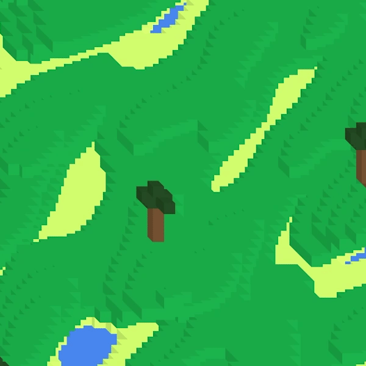

# Isometric Terrain Generator
- Made with C++ using the SFML library
 ```https://www.sfml-dev.org/index.php```
 
 ## How it works
 - Using Perlin Noise to created a height map
 - Draws isometric squares based on the value of the height map
 - Draws foliage based on chance



*work in progress*
